# Projects and dependencies analysis

This document provides a comprehensive overview of the projects and their dependencies in the context of upgrading to .NETCoreApp,Version=v10.0.

## Table of Contents

- [Executive Summary](#executive-Summary)
  - [Highlevel Metrics](#highlevel-metrics)
  - [Projects Compatibility](#projects-compatibility)
  - [Package Compatibility](#package-compatibility)
  - [API Compatibility](#api-compatibility)
- [Aggregate NuGet packages details](#aggregate-nuget-packages-details)
- [Top API Migration Challenges](#top-api-migration-challenges)
  - [Technologies and Features](#technologies-and-features)
  - [Most Frequent API Issues](#most-frequent-api-issues)
- [Projects Relationship Graph](#projects-relationship-graph)
- [Project Details](#project-details)

  - [Bot.Api\Bot.Api.csproj](#botapibotapicsproj)
  - [Bot.Base\Bot.Base.csproj](#botbasebotbasecsproj)
  - [Bot.Core\Bot.Core.csproj](#botcorebotcorecsproj)
  - [Bot.Database\Bot.Database.csproj](#botdatabasebotdatabasecsproj)
  - [Bot.DSharp\Bot.DSharp.csproj](#botdsharpbotdsharpcsproj)
  - [Bot.Main\Bot.Main.csproj](#botmainbotmaincsproj)
  - [Test.Bot.Base\Test.Bot.Base.csproj](#testbotbasetestbotbasecsproj)
  - [Test.Bot.Core\Test.Bot.Core.csproj](#testbotcoretestbotcorecsproj)
  - [Test.Bot.Database\Test.Bot.Database.csproj](#testbotdatabasetestbotdatabasecsproj)
  - [Test.Bot.DSharp\Test.Bot.DSharp.csproj](#testbotdsharptestbotdsharpcsproj)
  - [Test.Main\Test.Main.csproj](#testmaintestmaincsproj)

## Executive Summary

### Highlevel Metrics

| Metric | Count | Status |
| :--- | :---: | :--- |
| Total Projects | 11 | All require upgrade |
| Total NuGet Packages | 13 | 3 need upgrade |
| Total Code Files | 237 |  |
| Total Code Files with Incidents | 28 |  |
| Total Lines of Code | 14725 |  |
| Total Number of Issues | 96 |  |
| Estimated LOC to modify | 82+ | at least 0,6% of codebase |

### Projects Compatibility

| Project | Target Framework | Difficulty | Package Issues | API Issues | Est. LOC Impact | Description |
| :--- | :---: | :---: | :---: | :---: | :---: | :--- |
| [Bot.Api\Bot.Api.csproj](#botapibotapicsproj) | net6.0 | 🟢 Low | 0 | 2 | 2+ | ClassLibrary, Sdk Style = True |
| [Bot.Base\Bot.Base.csproj](#botbasebotbasecsproj) | net6.0 | 🟢 Low | 0 | 0 |  | ClassLibrary, Sdk Style = True |
| [Bot.Core\Bot.Core.csproj](#botcorebotcorecsproj) | net6.0 | 🟢 Low | 1 | 19 | 19+ | ClassLibrary, Sdk Style = True |
| [Bot.Database\Bot.Database.csproj](#botdatabasebotdatabasecsproj) | net6.0 | 🟢 Low | 1 | 1 | 1+ | ClassLibrary, Sdk Style = True |
| [Bot.DSharp\Bot.DSharp.csproj](#botdsharpbotdsharpcsproj) | net6.0 | 🟢 Low | 0 | 0 |  | ClassLibrary, Sdk Style = True |
| [Bot.Main\Bot.Main.csproj](#botmainbotmaincsproj) | net6.0 | 🟢 Low | 0 | 3 | 3+ | DotNetCoreApp, Sdk Style = True |
| [Test.Bot.Base\Test.Bot.Base.csproj](#testbotbasetestbotbasecsproj) | net6.0 | 🟢 Low | 1 | 0 |  | DotNetCoreApp, Sdk Style = True |
| [Test.Bot.Core\Test.Bot.Core.csproj](#testbotcoretestbotcorecsproj) | net6.0 | 🟢 Low | 0 | 57 | 57+ | DotNetCoreApp, Sdk Style = True |
| [Test.Bot.Database\Test.Bot.Database.csproj](#testbotdatabasetestbotdatabasecsproj) | net6.0 | 🟢 Low | 0 | 0 |  | DotNetCoreApp, Sdk Style = True |
| [Test.Bot.DSharp\Test.Bot.DSharp.csproj](#testbotdsharptestbotdsharpcsproj) | net6.0 | 🟢 Low | 0 | 0 |  | DotNetCoreApp, Sdk Style = True |
| [Test.Main\Test.Main.csproj](#testmaintestmaincsproj) | net6.0 | 🟢 Low | 0 | 0 |  | DotNetCoreApp, Sdk Style = True |

### Package Compatibility

| Status | Count | Percentage |
| :--- | :---: | :---: |
| ✅ Compatible | 10 | 76,9% |
| ⚠️ Incompatible | 1 | 7,7% |
| 🔄 Upgrade Recommended | 2 | 15,4% |
| ***Total NuGet Packages*** | ***13*** | ***100%*** |

### API Compatibility

| Category | Count | Impact |
| :--- | :---: | :--- |
| 🔴 Binary Incompatible | 0 | High - Require code changes |
| 🟡 Source Incompatible | 75 | Medium - Needs re-compilation and potential conflicting API error fixing |
| 🔵 Behavioral change | 7 | Low - Behavioral changes that may require testing at runtime |
| ✅ Compatible | 19678 |  |
| ***Total APIs Analyzed*** | ***19760*** |  |

## Aggregate NuGet packages details

| Package | Current Version | Suggested Version | Projects | Description |
| :--- | :---: | :---: | :--- | :--- |
| Destructurama.ByIgnoring | 1.1.0 |  | [Bot.Main.csproj](#botmainbotmaincsproj) | ✅Compatible |
| FuzzySharp | 2.0.2 |  | [Bot.Core.csproj](#botcorebotcorecsproj) | ✅Compatible |
| Microsoft.NET.Test.Sdk | 17.1.0 |  | [Test.Bot.Base.csproj](#testbotbasetestbotbasecsproj) [Test.Bot.Core.csproj](#testbotcoretestbotcorecsproj) [Test.Bot.Database.csproj](#testbotdatabasetestbotdatabasecsproj) [Test.Bot.DSharp.csproj](#testbotdsharptestbotdsharpcsproj) [Test.Main.csproj](#testmaintestmaincsproj) | ✅Compatible |
| MongoDB.Driver | 2.15.0 | 3.8.1 | [Bot.Database.csproj](#botdatabasebotdatabasecsproj) | NuGet package contains security vulnerability |
| Moq | 4.17.2 |  | [Test.Bot.Base.csproj](#testbotbasetestbotbasecsproj) | ✅Compatible |
| Newtonsoft.Json | 13.0.1 | 13.0.4 | [Bot.Core.csproj](#botcorebotcorecsproj) | NuGet package upgrade is recommended |
| Serilog | 2.10.0 |  | [Bot.Core.csproj](#botcorebotcorecsproj) [Bot.Database.csproj](#botdatabasebotdatabasecsproj) [Bot.DSharp.csproj](#botdsharpbotdsharpcsproj) [Bot.Main.csproj](#botmainbotmaincsproj) | ✅Compatible |
| Serilog.Formatting.Compact | 1.1.0 |  | [Bot.Core.csproj](#botcorebotcorecsproj) [Bot.Main.csproj](#botmainbotmaincsproj) | ✅Compatible |
| Serilog.Sinks.Console | 4.0.1 |  | [Bot.Main.csproj](#botmainbotmaincsproj) | ✅Compatible |
| Serilog.Sinks.Debug | 2.0.0 |  | [Bot.Main.csproj](#botmainbotmaincsproj) | ✅Compatible |
| Serilog.Sinks.File | 5.0.0 |  | [Bot.Main.csproj](#botmainbotmaincsproj) | ✅Compatible |
| xunit | 2.4.1 |  | [Test.Bot.Base.csproj](#testbotbasetestbotbasecsproj) | ⚠️NuGet package is deprecated |
| xunit.runner.visualstudio | 2.4.3 |  | [Test.Bot.Base.csproj](#testbotbasetestbotbasecsproj) [Test.Bot.Core.csproj](#testbotcoretestbotcorecsproj) [Test.Bot.Database.csproj](#testbotdatabasetestbotdatabasecsproj) [Test.Bot.DSharp.csproj](#testbotdsharptestbotdsharpcsproj) [Test.Main.csproj](#testmaintestmaincsproj) | ✅Compatible |

## Top API Migration Challenges

### Technologies and Features

| Technology | Issues | Percentage | Migration Path |
| :--- | :---: | :---: | :--- |

### Most Frequent API Issues

| API | Count | Percentage | Category |
| :--- | :---: | :---: | :--- |
| M:System.TimeSpan.FromSeconds(System.Double) | 46 | 56,1% | Source Incompatible |
| M:System.TimeSpan.FromHours(System.Double) | 11 | 13,4% | Source Incompatible |
| M:System.TimeSpan.FromMinutes(System.Double) | 7 | 8,5% | Source Incompatible |
| M:System.TimeSpan.FromDays(System.Double) | 6 | 7,3% | Source Incompatible |
| T:System.Uri | 3 | 3,7% | Behavioral Change |
| M:System.Uri.EscapeUriString(System.String) | 3 | 3,7% | Source Incompatible |
| M:System.TimeSpan.FromMilliseconds(System.Double) | 2 | 2,4% | Source Incompatible |
| E:System.AppDomain.ProcessExit | 2 | 2,4% | Behavioral Change |
| M:System.Environment.SetEnvironmentVariable(System.String,System.String) | 2 | 2,4% | Behavioral Change |

## Projects Relationship Graph

Legend:
📦 SDK-style project
⚙️ Classic project

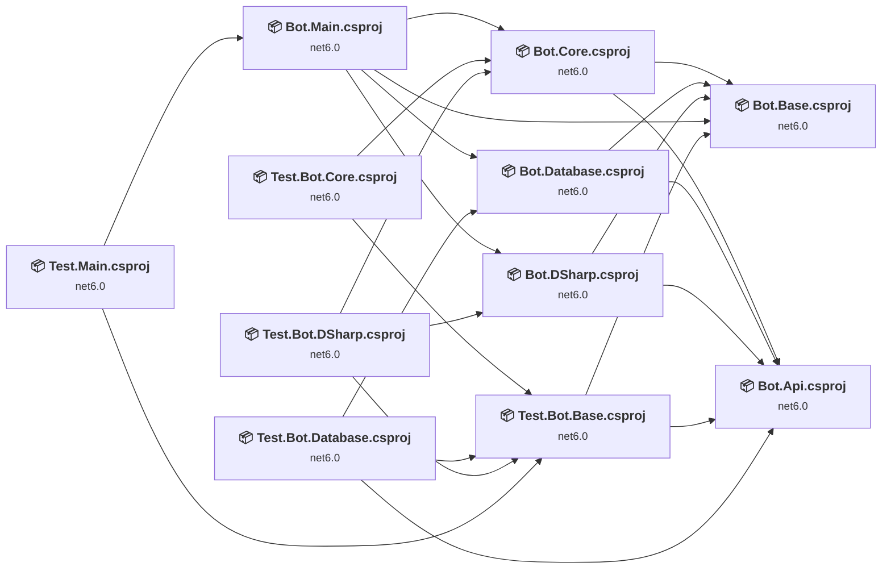

## Project Details

### Bot.Api\Bot.Api.csproj

#### Project Info

- **Current Target Framework:** net6.0
- **Proposed Target Framework:** net10.0
- **SDK-style**: True
- **Project Kind:** ClassLibrary
- **Dependencies**: 0
- **Dependants**: 5
- **Number of Files**: 52
- **Number of Files with Incidents**: 2
- **Lines of Code**: 1076
- **Estimated LOC to modify**: 2+ (at least 0,2% of the project)

#### Dependency Graph

Legend:
📦 SDK-style project
⚙️ Classic project

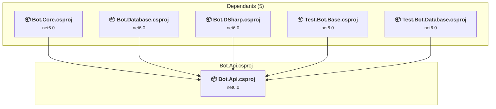

### API Compatibility

| Category | Count | Impact |
| :--- | :---: | :--- |
| 🔴 Binary Incompatible | 0 | High - Require code changes |
| 🟡 Source Incompatible | 2 | Medium - Needs re-compilation and potential conflicting API error fixing |
| 🔵 Behavioral change | 0 | Low - Behavioral changes that may require testing at runtime |
| ✅ Compatible | 692 |  |
| ***Total APIs Analyzed*** | ***694*** |  |

### Bot.Base\Bot.Base.csproj

#### Project Info

- **Current Target Framework:** net6.0
- **Proposed Target Framework:** net10.0
- **SDK-style**: True
- **Project Kind:** ClassLibrary
- **Dependencies**: 0
- **Dependants**: 5
- **Number of Files**: 2
- **Number of Files with Incidents**: 1
- **Lines of Code**: 70
- **Estimated LOC to modify**: 0+ (at least 0,0% of the project)

#### Dependency Graph

Legend:
📦 SDK-style project
⚙️ Classic project

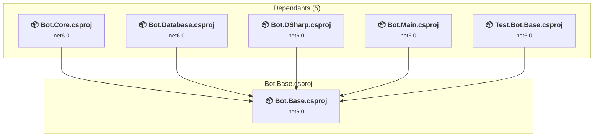

### API Compatibility

| Category | Count | Impact |
| :--- | :---: | :--- |
| 🔴 Binary Incompatible | 0 | High - Require code changes |
| 🟡 Source Incompatible | 0 | Medium - Needs re-compilation and potential conflicting API error fixing |
| 🔵 Behavioral change | 0 | Low - Behavioral changes that may require testing at runtime |
| ✅ Compatible | 50 |  |
| ***Total APIs Analyzed*** | ***50*** |  |

### Bot.Core\Bot.Core.csproj

#### Project Info

- **Current Target Framework:** net6.0
- **Proposed Target Framework:** net10.0
- **SDK-style**: True
- **Project Kind:** ClassLibrary
- **Dependencies**: 2
- **Dependants**: 3
- **Number of Files**: 84
- **Number of Files with Incidents**: 9
- **Lines of Code**: 4996
- **Estimated LOC to modify**: 19+ (at least 0,4% of the project)

#### Dependency Graph

Legend:
📦 SDK-style project
⚙️ Classic project

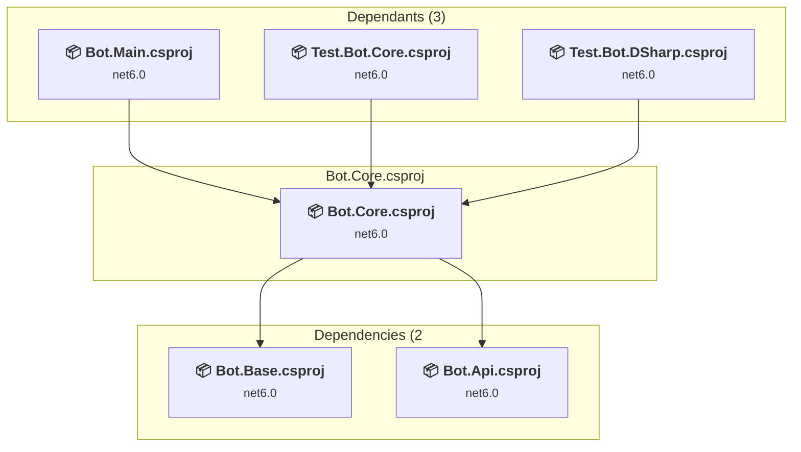

### API Compatibility

| Category | Count | Impact |
| :--- | :---: | :--- |
| 🔴 Binary Incompatible | 0 | High - Require code changes |
| 🟡 Source Incompatible | 16 | Medium - Needs re-compilation and potential conflicting API error fixing |
| 🔵 Behavioral change | 3 | Low - Behavioral changes that may require testing at runtime |
| ✅ Compatible | 3482 |  |
| ***Total APIs Analyzed*** | ***3501*** |  |

### Bot.Database\Bot.Database.csproj

#### Project Info

- **Current Target Framework:** net6.0
- **Proposed Target Framework:** net10.0
- **SDK-style**: True
- **Project Kind:** ClassLibrary
- **Dependencies**: 2
- **Dependants**: 2
- **Number of Files**: 21
- **Number of Files with Incidents**: 2
- **Lines of Code**: 925
- **Estimated LOC to modify**: 1+ (at least 0,1% of the project)

#### Dependency Graph

Legend:
📦 SDK-style project
⚙️ Classic project

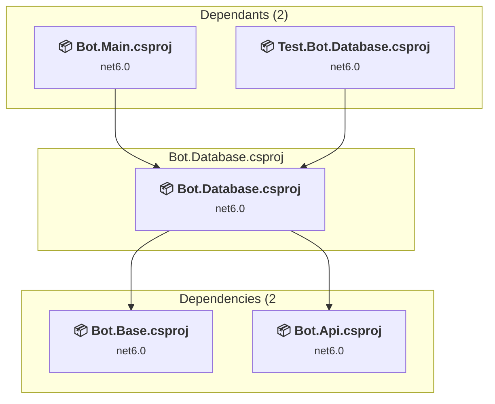

### API Compatibility

| Category | Count | Impact |
| :--- | :---: | :--- |
| 🔴 Binary Incompatible | 0 | High - Require code changes |
| 🟡 Source Incompatible | 1 | Medium - Needs re-compilation and potential conflicting API error fixing |
| 🔵 Behavioral change | 0 | Low - Behavioral changes that may require testing at runtime |
| ✅ Compatible | 892 |  |
| ***Total APIs Analyzed*** | ***893*** |  |

### Bot.DSharp\Bot.DSharp.csproj

#### Project Info

- **Current Target Framework:** net6.0
- **Proposed Target Framework:** net10.0
- **SDK-style**: True
- **Project Kind:** ClassLibrary
- **Dependencies**: 2
- **Dependants**: 2
- **Number of Files**: 29
- **Number of Files with Incidents**: 1
- **Lines of Code**: 1685
- **Estimated LOC to modify**: 0+ (at least 0,0% of the project)

#### Dependency Graph

Legend:
📦 SDK-style project
⚙️ Classic project

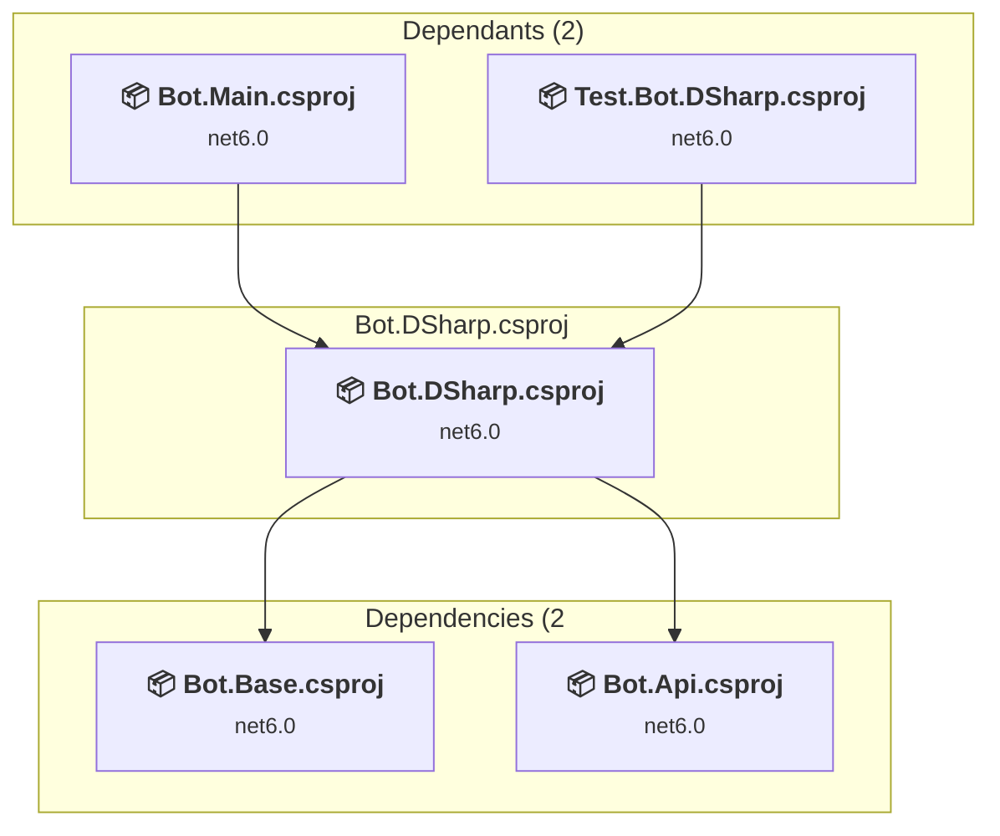

### API Compatibility

| Category | Count | Impact |
| :--- | :---: | :--- |
| 🔴 Binary Incompatible | 0 | High - Require code changes |
| 🟡 Source Incompatible | 0 | Medium - Needs re-compilation and potential conflicting API error fixing |
| 🔵 Behavioral change | 0 | Low - Behavioral changes that may require testing at runtime |
| ✅ Compatible | 690 |  |
| ***Total APIs Analyzed*** | ***690*** |  |

### Bot.Main\Bot.Main.csproj

#### Project Info

- **Current Target Framework:** net6.0
- **Proposed Target Framework:** net10.0
- **SDK-style**: True
- **Project Kind:** DotNetCoreApp
- **Dependencies**: 4
- **Dependants**: 1
- **Number of Files**: 5
- **Number of Files with Incidents**: 3
- **Lines of Code**: 185
- **Estimated LOC to modify**: 3+ (at least 1,6% of the project)

#### Dependency Graph

Legend:
📦 SDK-style project
⚙️ Classic project

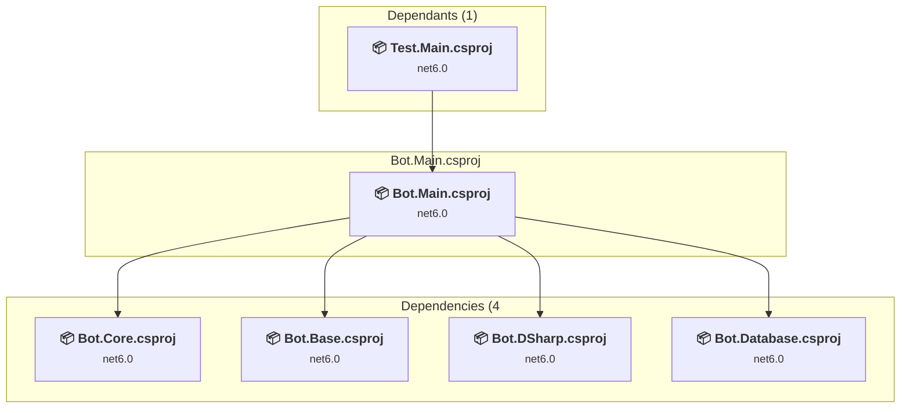

### API Compatibility

| Category | Count | Impact |
| :--- | :---: | :--- |
| 🔴 Binary Incompatible | 0 | High - Require code changes |
| 🟡 Source Incompatible | 0 | Medium - Needs re-compilation and potential conflicting API error fixing |
| 🔵 Behavioral change | 3 | Low - Behavioral changes that may require testing at runtime |
| ✅ Compatible | 214 |  |
| ***Total APIs Analyzed*** | ***217*** |  |

### Test.Bot.Base\Test.Bot.Base.csproj

#### Project Info

- **Current Target Framework:** net6.0
- **Proposed Target Framework:** net10.0
- **SDK-style**: True
- **Project Kind:** DotNetCoreApp
- **Dependencies**: 2
- **Dependants**: 4
- **Number of Files**: 8
- **Number of Files with Incidents**: 1
- **Lines of Code**: 275
- **Estimated LOC to modify**: 0+ (at least 0,0% of the project)

#### Dependency Graph

Legend:
📦 SDK-style project
⚙️ Classic project

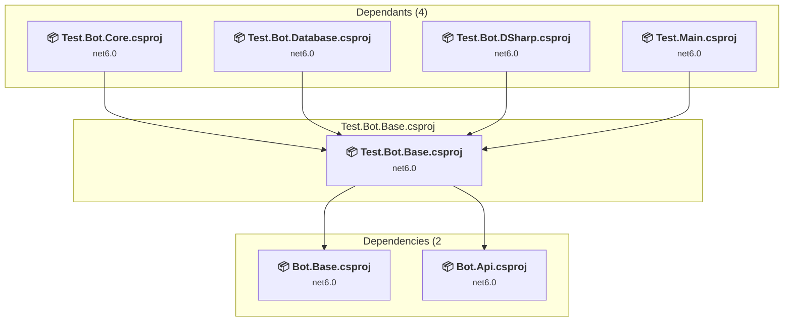

### API Compatibility

| Category | Count | Impact |
| :--- | :---: | :--- |
| 🔴 Binary Incompatible | 0 | High - Require code changes |
| 🟡 Source Incompatible | 0 | Medium - Needs re-compilation and potential conflicting API error fixing |
| 🔵 Behavioral change | 0 | Low - Behavioral changes that may require testing at runtime |
| ✅ Compatible | 226 |  |
| ***Total APIs Analyzed*** | ***226*** |  |

### Test.Bot.Core\Test.Bot.Core.csproj

#### Project Info

- **Current Target Framework:** net6.0
- **Proposed Target Framework:** net10.0
- **SDK-style**: True
- **Project Kind:** DotNetCoreApp
- **Dependencies**: 2
- **Dependants**: 0
- **Number of Files**: 33
- **Number of Files with Incidents**: 6
- **Lines of Code**: 4892
- **Estimated LOC to modify**: 57+ (at least 1,2% of the project)

#### Dependency Graph

Legend:
📦 SDK-style project
⚙️ Classic project

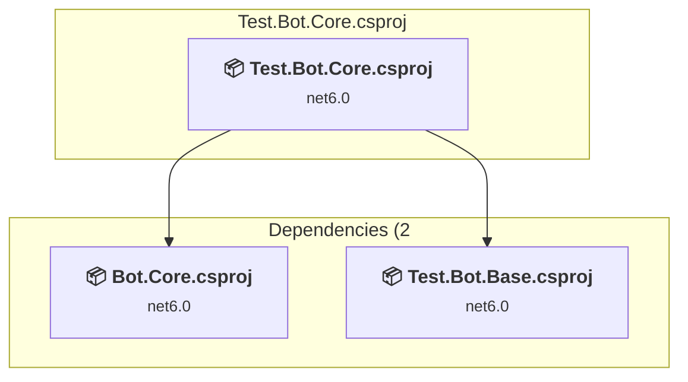

### API Compatibility

| Category | Count | Impact |
| :--- | :---: | :--- |
| 🔴 Binary Incompatible | 0 | High - Require code changes |
| 🟡 Source Incompatible | 56 | Medium - Needs re-compilation and potential conflicting API error fixing |
| 🔵 Behavioral change | 1 | Low - Behavioral changes that may require testing at runtime |
| ✅ Compatible | 11925 |  |
| ***Total APIs Analyzed*** | ***11982*** |  |

### Test.Bot.Database\Test.Bot.Database.csproj

#### Project Info

- **Current Target Framework:** net6.0
- **Proposed Target Framework:** net10.0
- **SDK-style**: True
- **Project Kind:** DotNetCoreApp
- **Dependencies**: 3
- **Dependants**: 0
- **Number of Files**: 6
- **Number of Files with Incidents**: 1
- **Lines of Code**: 214
- **Estimated LOC to modify**: 0+ (at least 0,0% of the project)

#### Dependency Graph

Legend:
📦 SDK-style project
⚙️ Classic project

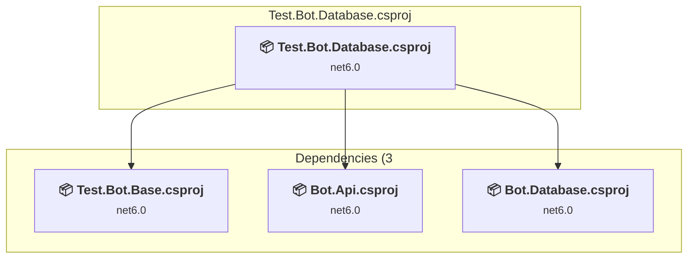

### API Compatibility

| Category | Count | Impact |
| :--- | :---: | :--- |
| 🔴 Binary Incompatible | 0 | High - Require code changes |
| 🟡 Source Incompatible | 0 | Medium - Needs re-compilation and potential conflicting API error fixing |
| 🔵 Behavioral change | 0 | Low - Behavioral changes that may require testing at runtime |
| ✅ Compatible | 437 |  |
| ***Total APIs Analyzed*** | ***437*** |  |

### Test.Bot.DSharp\Test.Bot.DSharp.csproj

#### Project Info

- **Current Target Framework:** net6.0
- **Proposed Target Framework:** net10.0
- **SDK-style**: True
- **Project Kind:** DotNetCoreApp
- **Dependencies**: 3
- **Dependants**: 0
- **Number of Files**: 8
- **Number of Files with Incidents**: 1
- **Lines of Code**: 370
- **Estimated LOC to modify**: 0+ (at least 0,0% of the project)

#### Dependency Graph

Legend:
📦 SDK-style project
⚙️ Classic project

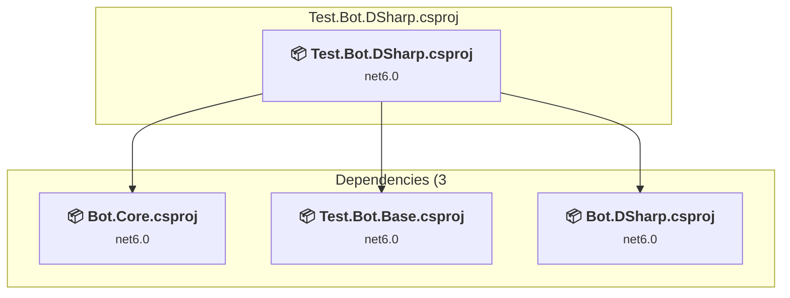

### API Compatibility

| Category | Count | Impact |
| :--- | :---: | :--- |
| 🔴 Binary Incompatible | 0 | High - Require code changes |
| 🟡 Source Incompatible | 0 | Medium - Needs re-compilation and potential conflicting API error fixing |
| 🔵 Behavioral change | 0 | Low - Behavioral changes that may require testing at runtime |
| ✅ Compatible | 1042 |  |
| ***Total APIs Analyzed*** | ***1042*** |  |

### Test.Main\Test.Main.csproj

#### Project Info

- **Current Target Framework:** net6.0
- **Proposed Target Framework:** net10.0
- **SDK-style**: True
- **Project Kind:** DotNetCoreApp
- **Dependencies**: 2
- **Dependants**: 0
- **Number of Files**: 4
- **Number of Files with Incidents**: 1
- **Lines of Code**: 37
- **Estimated LOC to modify**: 0+ (at least 0,0% of the project)

#### Dependency Graph

Legend:
📦 SDK-style project
⚙️ Classic project

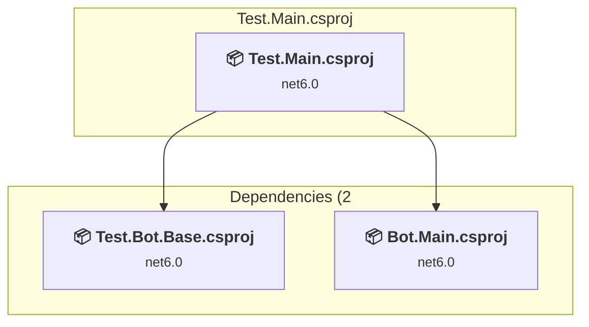

### API Compatibility

| Category | Count | Impact |
| :--- | :---: | :--- |
| 🔴 Binary Incompatible | 0 | High - Require code changes |
| 🟡 Source Incompatible | 0 | Medium - Needs re-compilation and potential conflicting API error fixing |
| 🔵 Behavioral change | 0 | Low - Behavioral changes that may require testing at runtime |
| ✅ Compatible | 28 |  |
| ***Total APIs Analyzed*** | ***28*** |  |

